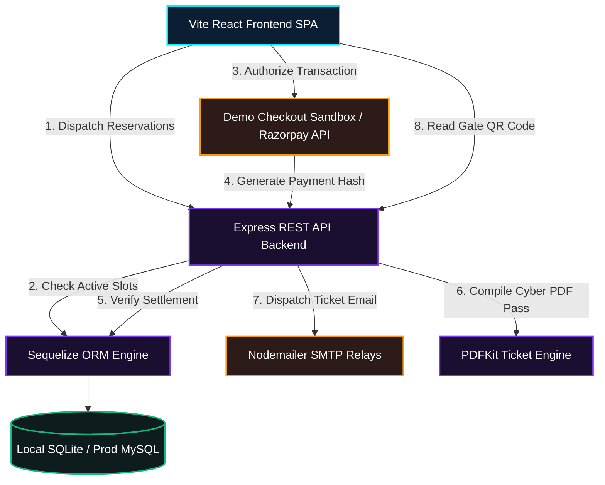

# Quantum Power Launch Event Portal ⚡
> Sleek, premium, futuristic startup-style web application for the revolutionary fuel-less magnetic-power electricity generator launch event. Designed in the aesthetics of a cutting-edge aerospace/product launch platform (Tesla/SpaceX-style).

[](file:///c:/Users/DELL/Desktop/All%20Projects/KVVS/README.md)
[](file:///c:/Users/DELL/Desktop/All%20Projects/KVVS/README.md)
[](file:///c:/Users/DELL/Desktop/All%20Projects/KVVS/README.md)

---

## 🌌 Application Architecture Overview

This platform coordinates the complete user lifecycle for the Quantum Power Generator Launch: from public specifications discovery, seat capacity checks, secure reservation checkouts, automatic high-tech PDF receipt compiles, automatic email dispatch, to physical admin QR-code entrance scans.



---

## ⚡ Key Core Capabilities

1. **Zero-Point Tech Showroom:** Immersive showcase of 2KW, 5KW, and 10KW fuel-less magnetic generator models with real-time technical specifications and visual parameters.
2. **Interactive Ticket Booking Sandbox:** A secure multivariable priority checkout interface supporting standard credit cards, UPI, and an instant **Demo Payment Sandbox Simulation** (allowing local developers to book, test, and register without real merchant keys).
3. **High-Tech Digital Pass Compiles:** Generates bespoke tickets utilizing a futuristic dark layout (designed with `pdfkit` and embedded QR codes), and dispatches them instantly to users via email attachments.
4. **Administrative CommandCenter Dashboard:** Visual command console tracking seat allocations, total financial transaction metrics, product-demand distribution ratios, and complete scrollable passenger boarding ledgers.
5. **Gate Clearance QR Scanner:** Optical entrance scanner utilizing webcams to read, validate, and record gate attendance logs. Features:
   - **Double-Entry Prevention:** Instantly blocks duplicate attempts, flashing a neon **DOUBLE ENTRY VIOLATION** along with the attendee's original boarding timestamp.
   - **Synthesized Web Audio Tones:** Emits success chimes and hazard alarms directly from browser audio oscillators (no static audio asset downloads required).
   - **Manual Bypass Input:** Provides manual passcode validation if camera hardware is unavailable.

---

## 📁 System Repository Structure

```text
KVVS/
├── backend/
│   ├── src/
│   │   ├── config/          # Dynamic SQLite / MySQL configurations
│   │   ├── controllers/     # Authentication, Booking, and Admin logic
│   │   ├── middleware/      # JWT Route clearance controls
│   │   ├── models/          # Sequelize schema entities (8 tables)
│   │   ├── routes/          # Express REST API routes map
│   │   └── services/        # PDFKit, QR dataURI, and Nodemailer dispatches
│   ├── .env                 # Active variables configuration
│   ├── .env.example         # System variables templates
│   └── server.js            # Express server entry point & seeder
├── database/
│   └── schema.sql           # Complete production raw MySQL schema script
└── frontend/
    ├── src/
    │   ├── components/      # Navbar, footer, countdown, route protections
    │   ├── context/         # AuthContext state synchronization
    │   ├── pages/           # Showrooms, bookings, history, and admin panels
    │   ├── services/        # central Axios API request mapping client
    │   ├── App.jsx          # Route endpoint registry definitions
    │   └── index.css        # Premium Glassmorphism and pulsing neon classes
    ├── tailwind.config.js   # Tailored cyberpunk theme configurations
    └── vite.config.js       # Vite server configurations with api path proxy
```

---

## 🛠️ Installation & Activation Guide

Follow these steps to deploy and execute the platform on your local server.

### Prerequisite Checklist
* **Node.js:** Ensure Node.js (v18+ recommended) is installed on your workstation.
* **Database (Optional):** The system defaults to **SQLite3** locally. You do not need to install MySQL to run the codebase! If you want MySQL, configure variables in `.env` as shown below.

### Phase 1: Establish Backend Server
1. Navigate to the backend directory:
   ```bash
   cd backend
   ```
2. Verify dependencies are installed (run `npm install` if not already completed):
   ```bash
   npm install
   ```
3. Configure your local environment variables in `backend/.env`. (Create the file if missing and copy contents from `backend/.env.example`).
   > [!TIP]
   > To use the auto-generating local **SQLite** database, leave `DB_HOST` and `DB_PASS` **blank**! The system will automatically spin up `backend/database.sqlite` on startup.

4. Fire up the backend engine:
   ```bash
   npm run dev
   ```
   *The console will show:* `[database] SQLite synchronisation successful.` and `[server] Cybernet active on port 5000.`

---

### Phase 2: Launch Frontend Portal
1. Navigate to the frontend directory:
   ```bash
   cd ../frontend
   ```
2. Verify dependencies are installed:
   ```bash
   npm install
   ```
3. Boot up the Vite developer server:
   ```bash
   npm run dev
   ```
   *The console will show:* `Vite server running at http://localhost:3000`

---

## 🔑 Administrative Clearances & Seeds

Upon initial database sync, the backend engine automatically seeds the necessary generator data and an administrator clearance account. You can log in using these credentials to access the Admin Panel and Gate Scanners.

* **Admin Command URL:** Click "Admin Panel" in the navigation bar, or navigate directly to [http://localhost:3000/login?admin=true](http://localhost:3000/login?admin=true)
* **Access Email:** `admin@quantumpower.com`
* **Access Password:** `Admin@3026`

---

## 🛡️ Entrance Clearance Testing Scenarios

1. **Verify Passenger Registry:** Log in or sign up a new account, head to **Showroom**, and click "Book Priority Event Pass" on any model.
2. **Checkout Sandbox:** Complete the wizard, click **Simulate Sandbox Payment**, and click approve.
3. **Verify Dashboard:** Go to your user profile menu to view your futuristic Ticket Pass with QR Code and download the custom generated dark cyber PDF receipt.
4. **Admin Verification:** Log out and log in as `admin@quantumpower.com` / `Admin@3026`. Navigate to the **Command Ctr** to inspect your registration in the scrollable ledger.
5. **Scanner Test:** Click **Gate Deployment Scanner**, allow camera permissions, and present the user QR code (either on a separate phone or uploaded) to the camera.
6. **Audit Double-Entry:** Once verified, scan the same QR code again. The screen will flash flashing red with a **DOUBLE ENTRY VIOLATION** and sound a detuned low-buzz alarm.

---

## 🔒 Security & Optimization Protocols

* **JWT Verification:** Authorization handles are attached to the HTTP headers dynamically. Rejections automatically clean outdated sessions in React.
* **Auto-Recovery SQLite Connection:** If your primary MySQL node goes offline, the system safely triggers its SQLite3 fallback to keep entry lines moving at the event.
* **Web Audio Oscillators:** Dynamic buzzers and success rings are computed programmatically in browser memory, maintaining a fast bundle footprint.
